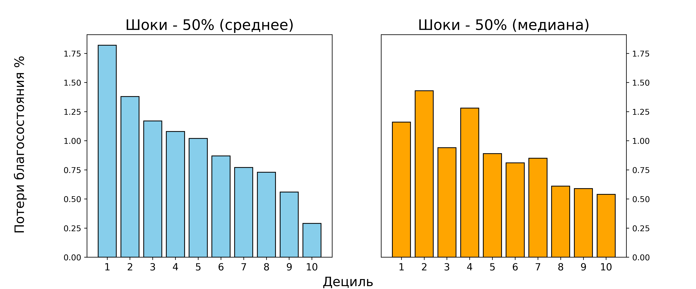
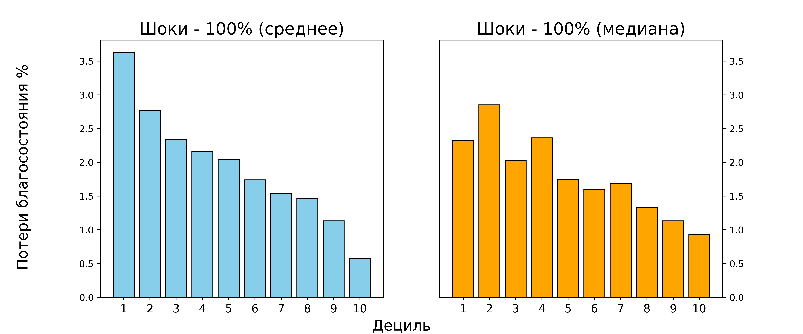
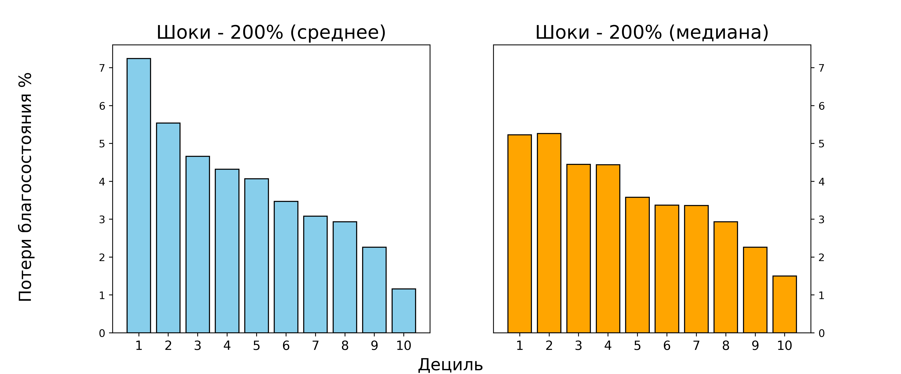
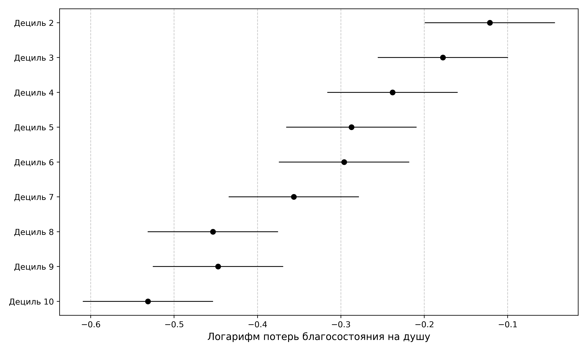
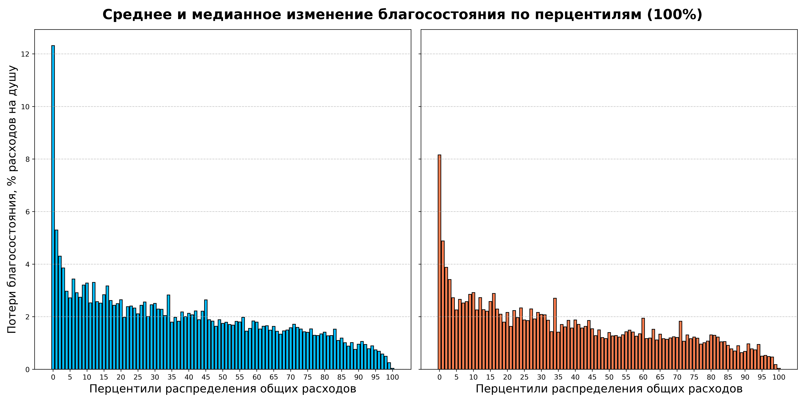

# <b>Влияние шоков цен (на 50%, 100%, 200%)  на растительное масло на благосостояние российских домохозяйств и показатели неравенства.</b> 

 

    

    Коршик Екатерина э402  
    Нелипа Матвей э402  
    Чертков Андрей э402
    

 

Только около четверти домохозяйств покупали растительное масло на исследуемой неделе, поэтому непокупавшим было вменено потребление в заисимости от следующих характеристик: число членов домохозяйства, место проживания, расходы на еду, перцентиль распределения общих расходов, тип главы домохозяйства. 
В анализе было использовано 4542 рядов. 

## <b>Расходы домохозяйств: средние по децилям на душу населения (руб.)</b>

| Дециль   |   Расходы |   Расходы на питание |   Расходы на растительное масло |   % общих расходов |
|:---------|----------:|---------------------:|--------------------------------:|-------------------:|
| 1        |   5122.29 |              2584.57 |                          742.89 |              14.5  |
| 2        |   7802.98 |              3750.69 |                          863.72 |              11.07 |
| 3        |   9670.96 |              4506.7  |                          901.78 |               9.32 |
| 4        |  11377.5  |              5056.72 |                          984.36 |               8.65 |
| 5        |  13161.2  |              5650.27 |                         1072.85 |               8.15 |
| 6        |  15292.5  |              6529.09 |                         1062.67 |               6.95 |
| 7        |  17811.3  |              7237.64 |                         1099.38 |               6.17 |
| 8        |  21049.3  |              8352.34 |                         1234.45 |               5.86 |
| 9        |  26917.4  |              9910.48 |                         1216.19 |               4.52 |
| 10       |  58031.5  |             11891.1  |                         1347.99 |               2.32 |
| Всего    |  18629.4  |              6547.27 |                         1052.63 |               5.65 |

 

    Таблица 1

 

Расходы 10 дециля на растительное малсло превышают расходы 1-го в 1,4 раза
Несмотря на то что в последних децилях люди тратят заметно больше, доля их расходов на растительное мало снижается

 

## <b>Расходы домохозяйств: медианные по децилям на душу населения (руб.)</b>

 

| Дециль   |   Расходы |   Расходы на питание |   Расходы на растительное масло |   % общих расходов |
|:---------|----------:|---------------------:|--------------------------------:|-------------------:|
| 1        |   5435.71 |              2494.52 |                         677.14  |              12.46 |
| 2        |   7783.82 |              3702.78 |                         741.31  |               9.52 |
| 3        |   9698.97 |              4496.54 |                         772.12  |               7.96 |
| 4        |  11367.1  |              4929.29 |                         813.83  |               7.16 |
| 5        |  13168.2  |              5593.4  |                         802.93  |               6.1  |
| 6        |  15268    |              6452.73 |                         830.51  |               5.44 |
| 7        |  17764.4  |              7136.82 |                         887.91  |               5    |
| 8        |  20962    |              8111.06 |                         977.44  |               4.66 |
| 9        |  26560.6  |              9395.14 |                        1028.57  |               3.87 |
| 10       |  43113.2  |             10537.1  |                        1114.28  |               2.58 |
| Всего    |  14171.5  |              5509.26 |                         830.098 |               5.86 |

 

    Таблица 2

 

## <b>Потери благосостояния при увеличении цены на пшеницу на 50% и 100% , руб. на душу и % расходов</b>

 

| Дециль   | Показатель   |   Расходы |   Расходы после 50% шока |   Изменение благосоcтояния (50%) |   Изменение благосостояния в процентах (50%) |   Расходы после 100% шока |   Изменение благосоcтояния (100%) |   Изменение благосостояния в процентах (100%) |
|:---------|:-------------|----------:|-------------------------:|---------------------------------:|---------------------------------------------:|--------------------------:|----------------------------------:|----------------------------------------------:|
| 1        | Среднее      |      5122 |                     5493 |                              371 |                                         7.24 |                      5865 |                               743 |                                         14.51 |
|          | Медиана      |      5435 |                     5719 |                              284 |                                         5.23 |                      6064 |                               629 |                                         11.57 |
| 2        | Среднее      |      7802 |                     8234 |                              432 |                                         5.54 |                      8666 |                               864 |                                         11.07 |
|          | Медиана      |      7783 |                     8192 |                              409 |                                         5.26 |                      8647 |                               864 |                                         11.1  |
| 3        | Среднее      |      9670 |                    10121 |                              451 |                                         4.66 |                     10572 |                               902 |                                          9.33 |
|          | Медиана      |      9698 |                    10130 |                              432 |                                         4.45 |                     10531 |                               833 |                                          8.59 |
| 4        | Среднее      |     11377 |                    11869 |                              492 |                                         4.32 |                     12361 |                               984 |                                          8.65 |
|          | Медиана      |     11367 |                    11872 |                              505 |                                         4.44 |                     12301 |                               934 |                                          8.22 |
| 5        | Среднее      |     13161 |                    13697 |                              536 |                                         4.07 |                     14234 |                              1073 |                                          8.15 |
|          | Медиана      |     13168 |                    13640 |                              472 |                                         3.58 |                     14125 |                               957 |                                          7.27 |
| 6        | Среднее      |     15292 |                    15823 |                              531 |                                         3.47 |                     16355 |                              1063 |                                          6.95 |
|          | Медиана      |     15267 |                    15781 |                              514 |                                         3.37 |                     16261 |                               994 |                                          6.51 |
| 7        | Среднее      |     17811 |                    18360 |                              549 |                                         3.08 |                     18910 |                              1099 |                                          6.17 |
|          | Медиана      |     17764 |                    18361 |                              597 |                                         3.36 |                     18884 |                              1120 |                                          6.3  |
| 8        | Среднее      |     21049 |                    21666 |                              617 |                                         2.93 |                     22283 |                              1234 |                                          5.86 |
|          | Медиана      |     20962 |                    21577 |                              615 |                                         2.93 |                     22235 |                              1273 |                                          6.07 |
| 9        | Среднее      |     26917 |                    27525 |                              608 |                                         2.26 |                     28133 |                              1216 |                                          4.52 |
|          | Медиана      |     26560 |                    27161 |                              601 |                                         2.26 |                     27825 |                              1265 |                                          4.76 |
| 10       | Среднее      |     58031 |                    58705 |                              674 |                                         1.16 |                     59379 |                              1348 |                                          2.32 |
|          | Медиана      |     43113 |                    43761 |                              648 |                                         1.5  |                     44490 |                              1377 |                                          3.19 |
| Всего    | Среднее      |     18629 |                    19155 |                              **526** |                                         **4.07** |                     19682 |                              **1052** |                                          **8.13** |
|          | Медиана      |     14171 |                    14679 |                              **415** |                                         **3.02** |                     15234 |                               **830** |                                          **6.04** |

 

    Таблица 3

 

За средними и медианными потерями по всей выборке скрываются значительные различия
потерь в разных частях распределения благосостояния (измеренного по расходам).

Несмотря на различие в тратах, более обеспеченные люди теряют намного меньше в результате шоков (если смотреть в относительных значениях)

 

## <b>Потери благосостояния при увеличении цены на пшеницу на 200% , руб. на душу и % расходов</b>

 

| Дециль   | Показатель   |   Расходы |   Расходы после 200% шока |   Изменение благосоcтояния (200%) |   Изменение благосостояния в процентах (200%) |
|:---------|:-------------|----------:|--------------------------:|----------------------------------:|----------------------------------------------:|
| 1        | Среднее      |      5122 |                      6608 |                              1486 |                                         29.01 |
|          | Медиана      |      5435 |                      6766 |                              1331 |                                         24.49 |
| 2        | Медиана      |      7783 |                      9421 |                              1638 |                                         21.05 |
|          | Среднее      |      7802 |                      9530 |                              1728 |                                         22.15 |
| 3        | Среднее      |      9670 |                     11474 |                              1804 |                                         18.66 |
|          | Медиана      |      9698 |                     11289 |                              1591 |                                         16.41 |
| 4        | Медиана      |     11367 |                     13092 |                              1725 |                                         15.18 |
|          | Среднее      |     11377 |                     13346 |                              1969 |                                         17.31 |
| 5        | Медиана      |     13168 |                     14989 |                              1821 |                                         13.83 |
|          | Среднее      |     13161 |                     15306 |                              2145 |                                         16.3  |
| 6        | Среднее      |     15292 |                     17417 |                              2125 |                                         13.9  |
|          | Медиана      |     15267 |                     17162 |                              1895 |                                         12.41 |
| 7        | Среднее      |     17811 |                     20010 |                              2199 |                                         12.35 |
|          | Медиана      |     17764 |                     19889 |                              2125 |                                         11.96 |
| 8        | Медиана      |     20962 |                     23343 |                              2381 |                                         11.36 |
|          | Среднее      |     21049 |                     23518 |                              2469 |                                         11.73 |
| 9        | Медиана      |     26560 |                     29144 |                              2584 |                                          9.73 |
|          | Среднее      |     26917 |                     29349 |                              2432 |                                          9.04 |
| 10       | Среднее      |     58031 |                     60727 |                              2696 |                                          4.65 |
|          | Медиана      |     43113 |                     45947 |                              2834 |                                          6.57 |
| Всего    | Среднее      |     18629 |                     20734 |                              **2105** |                                         **16.26** |
|          | Медиана      |     14171 |                     16226 |                              **1660** |                                         **12.08** |

 

    Таблица 4

 

## <b>Распределение потерь благосостояния по децилям</b>
 

 

    Рисунок 1

 

 

    Рисунок 2

 

 

    Рисунок 3

 

 

## <b>Оценка статистического различия логарифма потерь благосостояния по децилям, 95%-ные доверительные интервалы</b>
 

## <b>В случае 50% шоков</b>

 

    Рисунок 4

 

## <b>В случае 100% шоков</b>

 

    Рисунок 5

 

## <b>В случае 200% шоков</b>

 

    Рисунок 6

 

## <b>Распределение потерь благосостояния по перцентилям</b>
 
Вариация потерь благосостояния внутри децилей существенна, что видно из графиков
распределения потерь по перцентилям

 

 

    Рисунок 7

 

 

    Рисунок 8

 

 

    Рисунок 9

 

## <b>Индексы неравенства до и после увеличения цены на растительное масло</b>
 

| Индикатор                |   До шока |   После 50% шока |   После 100% шока |   После 200% шока |
|:-------------------------|----------:|-----------------:|------------------:|------------------:|
| Джинни                   |     0.382 |            0.409 |             0.42  |             0.442 |
| Индекс Аткинсона (e=0.5) |     0.127 |            0.146 |             0.154 |             0.17  |
| Индекс Аткинсона (e=1)   |     0.22  |            0.253 |             0.27  |             0.30   |
| Индекс Аткинсона (e=2)   |     0.369 |            0.429 |             0.584 |             0.594 |

 
    

        Таблица 5
    

 

## <b>Потери благосостояния в результате увеличения цены на растительное масло на 50% по типам глав домохозяйства, руб. на душу и % расходов</b>
 

|                                       |   глава Женщина пенс возраста |   глава Женщина трудоспос возраста |   глава Мужчина пенс возраста |   глава Мужчина трудоспос возраста |
|:--------------------------------------|------------------------------:|-----------------------------------:|------------------------------:|-----------------------------------:|
| Расходы, медиана |                 16194.2       |                      14959.2       |                 13818.6       |                      13287.8       |
| Расходы, среднее   |                 19374.6       |                      20743.6       |                 16797.6       |                      18373.4       |
| Расходы после 50% шока, медиана  |                 17106.5       |                      15449.9       |                 14370.1       |                      13719.6       |
| Расходы после 50% шока, среднее    |                 20226.2       |                      21256.7       |                 17373.8       |                      18755.6       |
| Изменение благосоcтояния (50%), медиана        |                   802.416     |                        390.599     |                   463.002     |                        302.114     |
| Изменение благосоcтояния (50%), среднее          |                   851.595     |                        513.115     |                   576.199     |                        382.264     |
| Изменение благосостояния в процентах (50%), медиана      |                     0.0512309 |                          0.0273925 |                     0.0377466 |                          0.0223845 |
| Изменение благосостояния в процентах (50%), медиана        |                     0.0572397 |                          0.0369324 |                     0.0488488 |                          0.0323443 |

 
    

        Таблица 6
    

 

## <b>Потери благосостояния в результате увеличения цены на растительное масло на 100% по типам глав домохозяйства, руб. на душу и % расходов</b>
 

|                                       |   глава Женщина пенс возраста |   глава Женщина трудоспос возраста |   глава Мужчина пенс возраста |   глава Мужчина трудоспос возраста |
|:--------------------------------------|------------------------------:|-----------------------------------:|------------------------------:|-----------------------------------:|
| Расходы, медиана |                  16194.2      |                      14959.2       |                 13818.6       |                      13287.8       |
| Расходы, среднее   |                  19374.6      |                      20743.6       |                 16797.6       |                      18373.4       |
| Расходы после 100% шока, медиана |                  17976.8      |                      15827.9       |                 14950.6       |                      14072.2       |
| Расходы после 100% шока, среднее   |                  21077.8      |                      21769.8       |                 17950         |                      19137.9       |
| Изменение благосоcтояния (100%), медиана       |                   1604.83     |                        781.199     |                   926.004     |                        604.228     |
| Изменение благосоcтояния (100%), среднее         |                   1703.19     |                       1026.23      |                  1152.4       |                        764.527     |
| Изменение благосостояния в процентах (100%), медиана     |                      0.102462 |                          0.054785  |                     0.0754931 |                          0.0447691 |
| Изменение благосостояния в процентах (100%), среднее       |                      0.114479 |                          0.0738648 |                     0.0976976 |                          0.0646886 |

 
    

        Таблица 7
    

 

## <b>Потери благосостояния в результате увеличения цены на растительное масло на 200% по типам глав домохозяйства, руб. на душу и % расходов</b>
 

|                                       |   глава Женщина пенс возраста |   глава Женщина трудоспос возраста |   глава Мужчина пенс возраста |   глава Мужчина трудоспос возраста |
|:--------------------------------------|------------------------------:|-----------------------------------:|------------------------------:|-----------------------------------:|
| Расходы, медиана |                  16194.2      |                        14959.2     |                  13818.6      |                      13287.8       |
| Расходы, среднее   |                  19374.6      |                        20743.6     |                  16797.6      |                      18373.4       |
| Расходы после 200% шока, медиана |                  19687.4      |                        16640.9     |                  15958.2      |                      14731.6       |
| Расходы после 200% шока, среднее   |                  22781        |                        22796       |                  19102.4      |                      19902.4       |
| Изменение благосоcтояния (200%), медиана       |                   3209.66     |                         1562.4     |                   1852.01     |                       1208.46      |
| Изменение благосоcтояния (200%), среднее         |                   3406.38     |                         2052.46    |                   2304.79     |                       1529.05      |
| Изменение благосостояния в процентах (200%), медиана     |                      0.204924 |                            0.10957 |                      0.150986 |                          0.0895382 |
| Изменение благосостояния в процентах (200%), среднее       |                      0.228959 |                            0.14773 |                      0.195395 |                          0.129377  |

 
    

        Таблица 8
    

 

## <b>Потери благосостояния в результате увеличения цены на растительное масло на 50% по типам поселения, руб. на душу и % расходов</b>
 

|                                       |           Город |          ПГТ |           Село |
|:--------------------------------------|--------------:|-------------:|--------------:|
| Расходы, медиана | 15015.7       | 13074.6      | 11955.1       |
| Расходы, среднее   | 19924.3       | 16930.3      | 15461.8       |
| Расходы после 50% шока, медиана  | 15521.3       | 13617.9      | 12640.3       |
| Расходы после 50% шока, среднее    | 20424.5       | 17381.8      | 16083         |
| Изменение благосоcтояния (50%), медиана        |   395.529     |   360        |   513.224     |
| Изменение благосоcтояния (50%), среднее          |   500.157     |   451.544    |   621.11      |
| Изменение благосостояния в процентах (50%), медиана     |     0.0264592 |     0.028757 |     0.0437836 |
| Изменение благосостояния в процентах (50%), среднее        |     0.034713  |     0.039853 |     0.0576072 |

 
    

        Таблица 9
    

 

## <b>Потери благосостояния в результате увеличения цены на растительное масло на 100% по типам поселения, руб. на душу и % расходов</b>
 

|                                       |           Город |          ПГТ |           Село |
|:--------------------------------------|--------------:|-------------:|--------------:|
| Расходы, медиана | 15015.7       | 13074.6      | 11955.1       |
| Расходы, среднее   | 19924.3       | 16930.3      | 15461.8       |
| Расходы после 100% шока, медиана | 16021.9       | 14000        | 13266.9       |
| Расходы после 100% шока, среднее   | 20924.6       | 17833.4      | 16704.1       |
| Изменение благосоcтояния (100%), медиана       |   791.058     |   720        |  1026.45      |
| Изменение благосоcтояния (100%), среднее         |  1000.31      |   903.087    |  1242.22      |
| Изменение благосостояния в процентах (100%), медиана     |     0.0529184 |     0.057514 |     0.0875672 |
| Изменение благосостояния в процентах (100%), среднее       |     0.0694261 |     0.079706 |     0.115214  |

 
    

        Таблица 10
    

 

## <b>Потери благосостояния в результате увеличения цены на растительное масло на 200% по типам поселения, руб. на душу и % расходов</b>
 

|                                       |          Город |          ПГТ |          Село |
|:--------------------------------------|-------------:|-------------:|-------------:|
| Расходы, медиана | 15015.7      | 13074.6      | 11955.1      |
| Расходы, среднее   | 19924.3      | 16930.3      | 15461.8      |
| Расходы после 200% шока, медиана | 17023        | 15114.4      | 14476        |
| Расходы после 200% шока, среднее   | 21924.9      | 18736.5      | 17946.3      |
| Изменение благосоcтояния (200%), медиана       |  1582.12     |  1440        |  2052.9      |
| Изменение благосоcтояния (200%), среднее         |  2000.63     |  1806.17     |  2484.44     |
| Изменение благосостояния в процентах (200%), медиана     |     0.105837 |     0.115028 |     0.175134 |
| Изменение благосостояния в процентах (200%), среднее       |     0.138852 |     0.159412 |     0.230429 |

 
    

        Таблица 11
    

 

## <b>Выводы:</b>

* Проанализированы последствия изменения мировых цен на растительное масло для благосостояния российских домохозяйств. В основе подхода — микросимуляционное моделирование расходной части бюджетов домохозяйств, что позволяет дать оценку потерям благосостояния каждого домохозяйства в результате ценовых шоков.

* Получены оценки средних и медианных потерь благосостояния в каждом дециле распределения расходов при моделировании роста цен на растительное масло на 50%, 100% и 200%. Наибольшие потери наблюдаются в первом и втором дециле. Меньше всего теряют домохозяйства самого богатого, десятого дециля.

* Вследствие шоков, приведших к увеличению цен на растительное масло, неравенство, как и ожидалось, увеличивается, что подтверждается ростом коэффициентов Джини и Аткинсона

* Микросимуляционный подход позволил выделить наиболее уязвимые социально-демографические группы: проживающие в сельской местности, а также домохозяйства во главе с женщиной-пенсионером.